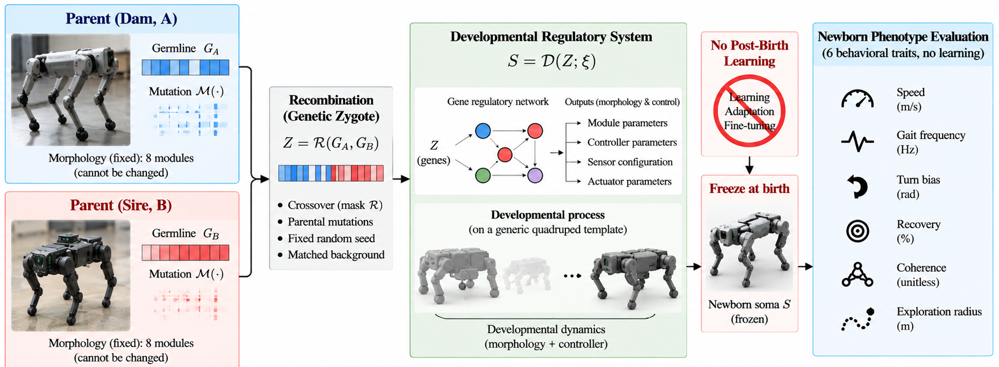

# Machine Zygote

<p align="center">
  
</p>

<p align="center">
  <strong>Causal Biparental Heredity Before Learning in a Germline–Soma Artificial Agent</strong>
</p>

<p align="center">
  Reproducible simulation, experiments, analysis, data, and validation code
</p>

---

## Overview

**Machine Zygote** is a computational framework for studying causal biparental heredity in artificial agents before post-birth learning.

The central idea is simple: two parent systems carry separate **germline** states. Their contributions are independently perturbed and recombined into a **zygote**. The zygote does not directly encode a finished controller. Instead, it parameterizes an endogenous **developmental regulatory process** acting on a fixed, initially generic soma.

After development, the newborn soma is frozen and evaluated before any post-birth learning or adaptation occurs.

The framework is designed around the following question:

> **Can two separately represented parental germlines measurably and causally influence the newborn phenotype of an artificial agent before learning?**

This repository accompanies the manuscript:

> **Machine Zygote: Causal Biparental Heredity Before Learning in a Germline–Soma Artificial Agent**

**Author:** Lyes Saad Saoud

### Scope

This work is a **computational proof of concept**.

No physical robot heredity experiment was performed. The framework does not claim biological DNA equivalence, physical machine reproduction, autonomous evolution, or experimental validation of physical robot heredity.

The quadruped robots shown in the framework illustration are conceptual representations of the fixed-template artificial agents. All experiments reported in the accompanying study are simulations.

---

## Quick Start

### 1. Clone the repository

```bash
git clone https://github.com/LyesSaadSaoud/machine-zygote.git
cd machine-zygote
```

### 2. Install the dependencies

Using `pip`:

```bash
pip install -r requirements.txt
```

Alternatively, using Conda:

```bash
conda env create -f environment.yml
conda activate machine-zygote
```

### 3. Run the complete experiment suite

```bash
python scripts/run_all.py
```

### 4. Run the analysis

```bash
python scripts/analyze_all.py
```

### 5. Generate the figures

```bash
python scripts/make_figures.py
```

### 6. Run the validation tests

```bash
python tests/run_tests.py
```

If `pytest` is installed, the tests can also be executed with:

```bash
python -m pytest tests/
```

The standard workflow can also be launched with:

```bash
make all
```

---

## Fast Smoke Test

A reduced smoke-test mode is provided for quickly checking the complete execution pipeline without running the full experiment suite:

```bash
python scripts/run_all.py --smoke-test
python scripts/analyze_all.py --smoke-test
python scripts/make_figures.py --smoke-test
```

The smoke test is intended for software and pipeline verification. It is not a replacement for the full experiments used for the reported scientific results.

---

# Machine Zygote Architecture

An artificial individual is represented as

```text
M = (G, S)
```

where:

- `G` is the **germline**;
- `S` is the **soma**.

The implemented germline contains **102 loci**, consisting of 99 autosomal loci and 3 maternally transmitted regulatory loci.

The physical body template is not inherited or structurally redesigned during reproduction. The soma uses a fixed eight-module template. Heritable variation acts through the germline-dependent regulatory and controller state generated through the developmental mapping.

This distinction is important:

> **Machine Zygote studies inheritance of developmental information, not mechanical crossover of robot bodies.**

---

## 1. Parental Germlines

Two parents carry independently represented germlines:

```text
Parent A → G_A
Parent B → G_B
```

The parental germlines are maintained separately before reproduction.

This makes it possible to experimentally distinguish the contribution of each parental channel to the resulting newborn phenotype.

---

## 2. Reproduction and Zygote Formation

The child zygote is generated through the reproduction operator

```text
Z_C = R(G_A, G_B, ξ)
```

where:

- `G_A` is the germline of one parent;
- `G_B` is the germline of the other parent;
- `ξ` represents the stochastic variables associated with mutation and recombination;
- `Z_C` is the resulting zygote.

Each parent first contributes a perturbed gametic germline.

For autosomal loci, inheritance is determined by a recombination mask with probability

```text
p = 0.5
```

for either parental contribution.

Three regulatory loci use a maternal transmission channel:

- developmental duration;
- developmental-noise amplitude;
- morphogen steepness.

Because of this asymmetric transmission channel, reciprocal crosses are not necessarily equivalent.

The zygote is therefore a new inherited state constructed from two separately represented parental germlines rather than a copy of either parent.

---

## 3. Development

The newborn soma is generated through

```text
S_C^(0) = D(Z_C, U, E_0)
```

where:

- `Z_C` is the zygote;
- `U` is the fixed generic soma template;
- `E_0` represents the initial developmental state/environment.

The generic soma contains **eight modules** with initially zero regulatory state.

Every module follows the same zygote-parameterized regulatory mechanism. Modules are differentiated through their position on the body axis rather than through separately inherited module-specific controllers.

A simplified representation of the developmental dynamics is

```text
dz_i/dt =
    -λ_i z_i
    + tanh(Σ_j W_ij z_j + b_i + s_i(p))
    + D∇²z
    + σ_dev dW
```

with positional input

```text
s_i(p) = s0_i + morph_i · tanh(steep · p)
```

Spatial differentiation can therefore arise from the interaction of:

- positional information;
- regulatory interactions;
- inter-module coupling;
- developmental dynamics;
- developmental stochasticity.

At the individual-specific developmental duration, the regulatory state is **frozen**.

---

## 4. Differentiation

A fixed, universal, non-heritable readout maps the frozen developmental state into the functional state used by the newborn controller.

The readout determines graded functional quantities associated with:

- sensing;
- left-motor contribution;
- right-motor contribution;
- interneuron-like processing;
- memory-like state;
- self-excitation;
- adaptation gain;
- adaptation time constant;
- connectivity derived from module-expression similarity.

The differentiation/readout rule itself is fixed and is not a heritable parameter.

Thus, the framework separates:

```text
Germline
   ↓
Zygote
   ↓
Developmental / regulatory state
   ↓
Differentiation
   ↓
Newborn soma
   ↓
Pre-learning phenotype
```

from direct inheritance of an already completed controller.

---

## 5. Freeze at Birth

Once development is complete, the resulting soma is frozen before phenotype measurement.

During newborn evaluation there is:

- no reward optimization;
- no gradient update;
- no reinforcement-learning step;
- no post-birth plasticity;
- no controller training;
- no parameter adaptation.

This provides a clean separation between **inherited pre-learning phenotype** and behavior that could otherwise emerge through post-birth learning.

---

# Newborn Phenotype

The developed soma controls a standardized simulated differential-drive embodiment.

Six newborn behavioral traits are measured:

1. **Mean speed**
2. **Gait frequency**
3. **Turning bias**
4. **Perturbation recovery time**
5. **Inter-module coherence**
6. **Exploration radius**

These measurements are taken before any post-birth learning.

---

# Experimental Design

Machine Zygote contains five main experimental components.

## Parental Crosses

```text
experiments/exp01_parental_crosses.py
```

This experiment performs the balanced `4 × 4` parental diallel together with parental reference conditions.

It includes:

- parental reference conditions;
- biparental crosses;
- reciprocal crosses;
- newborn phenotype measurements.

The principal diallel contains **640 offspring**, with 40 offspring generated for each parental cell.

The diallel provides the main statistical test of whether newborn phenotype depends on both parental identities.

---

## Matched-Background Germline Substitution

```text
experiments/exp02_causal_swap.py
```

This experiment provides the principal causal intervention in Machine Zygote.

One parental germline is replaced while the relevant stochastic background is held matched.

The matched quantities include the corresponding:

- recombination mask;
- mutation realization;
- developmental-noise seed;
- experimental background.

The resulting phenotype displacement can then be compared against stochastic control conditions, including same-parent re-mutation and re-development controls.

This intervention is designed to distinguish genuine parental-germline dependence from phenotype differences produced merely by stochastic rerunning of the same system.

Strong causal interpretation is restricted to this matched-background intervention.

---

## Baselines and Ablations

```text
experiments/exp03_baselines.py
```

This experiment contains comparison and ablation conditions including:

- random germline;
- no-development conditions;
- direct-controller crossover;
- ablated parental-cross conditions.

These baselines test whether effects attributed to the germline–zygote architecture can instead be reproduced by simpler alternative mechanisms.

The developmental-dynamics ablation is particularly important for interpretation: the study does **not** assume that recurrent developmental dynamics must be necessary for biparental heredity.

The corresponding hypothesis is evaluated empirically.

---

## Multigeneration Transmission

```text
experiments/exp04_multigeneration.py
```

The multigeneration experiment evaluates transmission across:

```text
G0 → G1 → G2
```

without selection.

The experiment examines transmission under recombination, mutation, developmental variation, and stochastic drift.

It is **not** presented as evidence of autonomous evolution.

---

## Robustness Analysis

```text
experiments/exp05_robustness.py
```

The robustness experiment evaluates the framework across parameter sweeps involving:

- developmental noise;
- regulatory coupling;
- mutation amplitude;
- developmental duration.

The purpose is to determine whether the principal parental-dependence result is restricted to a single parameter setting or persists across perturbations of the simulation regime.

---

# Main Findings

The accompanying experiments support several distinct conclusions.

### Biparental newborn dependence

The balanced parental diallel provides evidence that both parental identities contribute to newborn phenotype.

Significant contributions from both parental channels are observed for five of the six measured newborn traits after multiple-comparison correction.

### Matched-background causal effects

Replacing only one parental germline under matched stochastic backgrounds produces significant phenotype displacement for five of the six traits for both parental channels.

This provides the principal intervention-based evidence for causal parental-germline influence.

### Transgressive offspring

Biparental recombination produces excess transgressive offspring for selected traits, particularly mean speed and gait frequency, relative to the corresponding clone/reference conditions.

### Developmental-dynamics necessity

The stronger hypothesis that recurrent developmental dynamics are necessary for the observed heredity effect is **not supported** by the quasistatic ablation.

The quasistatic condition preserves the overall mean phenotype distribution while altering aspects of parental variance structure.

This distinction is important:

> The experiments support causal biparental pre-learning heredity within the implemented simulation, but they do not establish that recurrent developmental dynamics are necessary for that heredity.

### Robustness

The principal parental-dependence criterion is recovered across the tested robustness sweep conditions, although the number and magnitude of significant trait-level effects vary with the simulation regime.

---

# Reproducibility

Machine Zygote uses a frozen master seed:

```text
MASTER_SEED = 20260823
```

defined in:

```text
src/config.py
```

Derived seeds are generated deterministically from labeled inputs using BLAKE2b-based seed derivation.

The design separates stochastic streams so that an individual's developmental noise is associated with its own derived seed rather than its position in a processing batch.

The repository includes tests for deterministic behavior and experimental consistency.

Each experiment also writes provenance information containing relevant execution metadata, including:

- Python version;
- package versions;
- master seed;
- experiment configuration;
- configuration digest;
- hardware information;
- execution timestamp;
- repository state when available.

Raw experimental outputs are included so that the reported statistical analysis can be inspected without requiring the complete simulation to be rerun.

Exact numerical reproducibility can depend on the operating system, Python version, numerical libraries, and underlying numerical implementation. The supplied dependency specifications and provenance records are therefore included to facilitate faithful reproduction of the reported experiments.

---

# Integrity and Analysis Rules

The analysis decisions and frozen experimental rules are documented in:

[`configs/preregistration.md`](configs/preregistration.md)

The repository follows the following principles:

- Reported numerical results are computed from stored experimental outputs rather than manually inserted into the analysis.
- Experimental individuals are not silently discarded from the principal analysis.
- Degenerate or problematic individuals are flagged and retained where specified by the analysis protocol.
- Unsupported hypotheses are explicitly reported as unsupported.
- Multiple-comparison correction is applied where specified by the analysis.
- `PDVF`, the **parental developmental variance fraction**, is treated as a study-specific variance measure and is not described as biological narrow-sense heritability.
- Strong causal language is restricted to the matched-background germline-substitution intervention.
- Multigeneration experiments contain no selection and are not described as autonomous evolution.
- The physical robot illustrations are conceptual and are not presented as experimental hardware evidence.

---

# Reproducing the Analysis from Existing Outputs

The repository contains the raw experimental results used for analysis.

To recompute the statistical summaries without rerunning the complete simulation:

```bash
python scripts/analyze_all.py
```

To regenerate the figures from the available outputs:

```bash
python scripts/make_figures.py
```

This allows the numerical analysis and visualization pipeline to be audited independently from the computational cost of regenerating all simulated individuals.

---

# Output Structure

Generated and archived results are stored under:

| Path | Description |
|---|---|
| `outputs/raw/` | Replicate-level simulation outputs and provenance records |
| `outputs/processed/` | Processed experiment-level statistics |
| `outputs/figures/` | Generated PDF and high-resolution PNG figures |
| `outputs/logs/` | Execution and provenance information |
| `outputs/paper1_summary.json` | Internal machine-readable summary produced by the current analysis scripts |
| `outputs/PAPER1_RESULTS.md` | Internal human-readable result report produced by the current analysis scripts |

The two filenames containing `paper1`/`PAPER1` are retained only because they are existing internal output filenames used by the current reproducibility pipeline. They do not denote a separate public project. The repository and accompanying work are referred to simply as **Machine Zygote**.

---

# Repository Layout

```text
machine-zygote/
│
├── assets/
│   └── machine_zygote_framework.png
│
├── configs/
│   └── preregistration.md
│
├── experiments/
│   ├── exp01_parental_crosses.py
│   ├── exp02_causal_swap.py
│   ├── exp03_baselines.py
│   ├── exp04_multigeneration.py
│   └── exp05_robustness.py
│
├── outputs/
│   ├── raw/
│   ├── processed/
│   ├── figures/
│   ├── logs/
│   ├── PAPER1_RESULTS.md
│   └── paper1_summary.json
│
├── scripts/
│   ├── run_all.py
│   ├── analyze_all.py
│   └── make_figures.py
│
├── src/
│   ├── __init__.py
│   ├── config.py
│   ├── development.py
│   ├── embodiment.py
│   ├── germline.py
│   ├── interventions.py
│   ├── metrics.py
│   ├── phenotype.py
│   ├── reproduction.py
│   ├── soma.py
│   ├── statistics.py
│   └── zygote.py
│
├── supplement/
│   └── METHODS.md
│
├── tests/
│   ├── __init__.py
│   ├── run_tests.py
│   ├── test_determinism.py
│   ├── test_development.py
│   ├── test_germline.py
│   └── test_reproduction.py
│
├── environment.yml
├── requirements.txt
├── Makefile
├── LICENSE
└── README.md
```

---

# Scientific Interpretation

Machine Zygote is intended to provide an intervention-centered computational framework for separating:

```text
parental identity
        ↓
parental germlines
        ↓
mutation + recombination
        ↓
zygote
        ↓
developmental / regulatory mapping
        ↓
frozen newborn soma
        ↓
pre-learning phenotype
```

from mechanisms such as:

```text
post-birth learning
direct controller copying
random rerunning
selection
physical body crossover
```

Within the implemented simulation, the results support the conclusion that **two separately represented parental germlines can measurably and causally influence newborn artificial phenotype before post-birth learning**.

The results do not establish:

- biological genetic equivalence;
- physical machine heredity;
- physical robot reproduction;
- autonomous robot reproduction;
- autonomous evolution;
- biological heritability;
- physical experimental validation.

---

# Citation

If you use Machine Zygote or build upon this repository, please cite the accompanying manuscript:

```bibtex
@article{saoud_machine_zygote_2026,
  author = {Lyes Saad Saoud},
  title  = {Machine Zygote: Causal Biparental Heredity Before Learning in a Germline--Soma Artificial Agent},
  year   = {2026},
  note   = {Manuscript under review}
}
```

The citation will be updated with the final journal, volume, pages, and DOI when bibliographic information becomes available.

---

# Author

**Lyes Saad Saoud**

For questions concerning the implementation, reproducibility, or scientific methodology, please use the GitHub repository's issue tracker.

---

# License

Machine Zygote is released under the **MIT License**.

See [`LICENSE`](LICENSE) for the complete license text.

---

# Repository

**Machine Zygote**

https://github.com/LyesSaadSaoud/machine-zygote